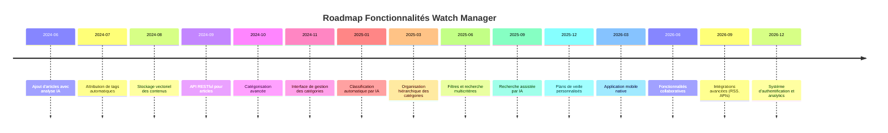

## 🗺️ Timeline des fonctionnalités

# Roadmap - Watch Manager

## 🎯 Vision

Watch Manager a pour objectif de devenir **l'outil d'accompagnement ultime pour la veille technique**, permettant aux développeurs et professionnels IT de rester à jour avec les dernières tendances technologiques de manière intelligente et organisée.

## 🚀 Fonctionnalités principales

### ✅ Phase 1 : Base fonctionnelle (Terminée)
- [x] **Ajout d'articles avec analyse IA**
  - Extraction automatique du contenu web
  - Résumé automatique par IA
  - Attribution de tags automatiques
  - Stockage avec embeddings vectoriels (1536 dimensions)

### 🔄 Phase 2 : Organisation (En cours)
- [x] **API RESTful** pour la gestion des articles
- [x] **Catégorisation avancée des articles**

  #### 🎛️ Interface de gestion des catégories
  - **Création et édition de catégories** : Interface intuitive pour créer, modifier et supprimer des catégories personnalisées
  - **Métadonnées enrichies** : Description, couleur, icône et mots-clés pour chaque catégorie
  - **Gestion des règles de classification** : Définition de critères automatiques (mots-clés, domaines, sources)
  - **Aperçu en temps réel** : Prévisualisation du nombre d'articles affectés par catégorie

  #### 🤖 Classification automatique par IA
  - **Analyse sémantique** : Utilisation des embeddings existants pour comprendre le contenu des articles
  - **Apprentissage supervisé** : Amélioration continue basée sur les corrections manuelles des utilisateurs
  - **Classification multi-label** : Possibilité d'assigner plusieurs catégories à un même article
  - **Score de confiance** : Indication du niveau de certitude de la classification automatique
  - **Suggestions intelligentes** : Proposition de nouvelles catégories basées sur les contenus analysés

  #### 🌳 Organisation hiérarchique des catégories
  - **Structure arborescente** : Catégories parentes et sous-catégories pour une organisation logique
  - **Héritage des propriétés** : Les sous-catégories héritent automatiquement des règles de leurs parents
  - **Réorganisation par glisser-déposer** : Interface intuitive pour restructurer la hiérarchie
  - **Chemins de navigation** : Breadcrumbs pour naviguer facilement dans l'arborescence
  - **Vues multiples** : Affichage en liste, arbre ou grille selon les préférences

  #### 🔍 Filtres et recherche par catégorie
  - **Filtrage multicritères** : Combinaison de catégories, tags, dates et sources
  - **Recherche facettée** : Navigation par facettes avec compteurs d'articles
  - **Sauvegarde de filtres** : Création de vues personnalisées réutilisables
  - **Recherche textuelle enrichie** : Recherche dans les catégories, descriptions et métadonnées
  - **Exports ciblés** : Possibilité d'exporter des articles filtrés par catégorie

### 🔮 Phase 3 : Accompagnement intelligent à la veille

#### 🔍 Recherche assistée par IA
- [ ] **Résolution de problèmes**
  - [ ] Interface de saisie de problématiques
  - [x] Recherche sémantique dans la base d'articles
  - [x] Suggestions d'articles pertinents
  - [ ] Synthèse des solutions trouvées

#### 🎲 Apprentissage dirigé
- [ ] **Choix de sujets aléatoires**
  
  #### 🎯 Sélection intelligente de contenus
  - **Algorithme de découverte** : Sélection d'articles non consultés basée sur les lacunes de connaissances identifiées
  - **Filtrage par niveau d'expertise** : Adaptation automatique selon le profil technique utilisateur (junior, senior, expert)
  - **Diversité thématique garantie** : Équilibrage entre technologies maîtrisées et domaines à explorer
  - **Évitement de la surcharge cognitive** : Limitation du nombre de nouveaux concepts par session
  - **Contextualisation professionnelle** : Priorisation selon les projets en cours et objectifs de carrière
  - **Trending topics** : Intégration des technologies émergentes et sujets d'actualité

  #### 🏷️ Filtrage par domaine de compétence
  - **Cartographie des compétences** : Mapping automatique des domaines techniques selon l'historique de lecture
  - **Niveaux de maîtrise granulaires** : Évaluation fine des connaissances (découverte, apprentissage, maîtrise, expertise)
  - **Recommandations progressives** : Suggestions de sujets suivant une courbe d'apprentissage optimale
  - **Détection des prérequis** : Identification des concepts fondamentaux nécessaires avant approfondissement
  - **Synergie inter-domaines** : Mise en avant des technologies complémentaires et interconnexions
  - **Adaptation temporelle** : Ajustement selon l'évolution des compétences et changements de rôle

  #### 🎮 Génération d'exercices pratiques par IA
  - **Contextualisation automatique** : Création d'exercices basés sur le contenu des articles consultés
  - **Niveaux de difficulté adaptatifs** : Challenges progressifs selon les compétences acquises
  - **Formats diversifiés** : Quiz, projets pratiques, analyses de code, résolution de problèmes
  - **Scénarios réels** : Simulation de cas d'usage professionnels et problématiques concrètes
  - **Feedback instantané** : Correction automatique avec explications détaillées et ressources complémentaires
  - **Gamification intelligente** : Système de points, badges et défis pour maintenir l'engagement

  #### 📊 Suivi de progression avancé
  - **Métriques d'apprentissage** : Vitesse d'acquisition, taux de rétention, et profondeur de compréhension
  - **Visualisations de croissance** : Graphiques de progression par domaine et timeline d'évolution
  - **Détection de plateaux** : Identification automatique des périodes de stagnation avec suggestions d'actions
  - **Corrélation performance** : Analyse de l'impact de l'apprentissage sur l'efficacité professionnelle
  - **Prédiction de besoins** : Anticipation des compétences futures nécessaires selon les tendances du marché
  - **Portfolios de compétences** : Documentation automatique des acquis avec preuves et certifications

  #### 🎲 Mécanismes de randomisation intelligente
  - **Sérendipité contrôlée** : Découverte de sujets inattendus mais pertinents pour l'élargissement des horizons
  - **Algorithmes de surprise** : Introduction de concepts adjacents pour stimuler la créativité et l'innovation
  - **Rotation thématique** : Alternance automatique entre différents domaines pour éviter la spécialisation excessive
  - **Facteur curiosité** : Prise en compte des intérêts personnels et passions pour maintenir la motivation
  - **Apprentissage par contraste** : Présentation de technologies alternatives pour développer l'esprit critique
  - **Exploration dirigée** : Parcours découverte avec objectifs pédagogiques cachés mais structurés

  #### 🧠 Personnalisation cognitive
  - **Profils d'apprentissage** : Adaptation selon les préférences cognitives (visuel, auditif, kinesthésique)
  - **Rythmes personnels** : Respect des cycles d'attention et périodes optimales de concentration
  - **Styles de traitement** : Support pour approches analytiques vs synthétiques, théorie vs pratique
  - **Mémorisation optimisée** : Utilisation de techniques de répétition espacée et ancrage mémoriel
  - **Gestion de la charge cognitive** : Dosage intelligent de la complexité selon les capacités momentanées
  - **Adaptation émotionnelle** : Prise en compte du stress, motivation et confiance pour optimiser l'apprentissage

  #### 📅 Planification de veille
- [ ] **Plans de veille personnalisés**
  
  #### ⚙️ Configuration des plans de veille
  - **Fréquences multiples** : Support de planifications quotidiennes, hebdomadaires, mensuelles et personnalisées
  - **Profils de veille** : Création de profils thématiques (Frontend, Backend, DevOps, IA, etc.)
  - **Quotas intelligents** : Définition du nombre d'articles par session selon le temps disponible
  - **Horaires préférés** : Configuration des créneaux de veille optimaux selon l'emploi du temps
  - **Seuils de pertinence** : Ajustement automatique du niveau de complexité selon l'expertise utilisateur
  - **Exclusions temporaires** : Pause automatique pendant congés ou périodes chargées

  #### 🎯 Sélection automatique de contenus
  - **Algorithme de recommandation** : Sélection basée sur l'historique de lecture et les préférences utilisateur
  - **Diversité thématique** : Équilibrage automatique entre sujets familiers et nouvelles découvertes
  - **Priorisation intelligente** : Articles récents, tendances émergentes et sujets manqués prioritaires
  - **Filtrage par niveau** : Adaptation du contenu selon le niveau technique (débutant, intermédiaire, expert)
  - **Sources équilibrées** : Répartition entre différents types de sources (blogs, documentation, actualités)
  - **Évitement des doublons** : Détection sémantique des contenus similaires déjà consultés

  #### 📊 Calendrier de veille intelligent
  - **Planning adaptatif** : Ajustement automatique selon la charge de travail et les événements calendrier
  - **Synchronisation externe** : Intégration avec Google Calendar, Outlook, et autres agendas
  - **Sessions de rattrapage** : Reprogrammation automatique des sessions manquées
  - **Blocs de temps optimisés** : Suggestion de créneaux selon l'énergie cognitive disponible
  - **Préparation de sessions** : Pré-chargement et organisation des articles avant chaque session
  - **Métriques de planification** : Statistiques sur l'efficacité des créneaux choisis

  #### 🔔 Notifications et rappels
  - **Canaux multiples** : Notifications push, email, SMS selon les préférences et l'urgence
  - **Personnalisation contextuelle** : Adaptation du ton et du contenu selon le moment de la journée
  - **Rappels progressifs** : Séquence d'alertes douces avant les sessions planifiées
  - **Résumés préparatoires** : Aperçu des articles sélectionnés 30 minutes avant la session
  - **Alertes de tendances** : Notifications urgentes pour les sujets critiques ou tendances majeures
  - **Feedback en temps réel** : Ajustement des notifications selon les réactions utilisateur

  #### 📈 Tableau de bord de suivi
  - **Métriques de progression** : Suivi des domaines couverts, lacunes identifiées, et objectifs atteints
  - **Visualisations interactives** : Graphiques de progression, cartes de compétences, et timelines d'apprentissage
  - **Analyse de performance** : Corrélation entre planning de veille et productivité professionnelle
  - **Recommandations d'ajustement** : Suggestions d'optimisation basées sur les patterns de consommation
  - **Rapports périodiques** : Synthèses hebdomadaires/mensuelles avec points clés et nouvelles découvertes
  - **Objectifs gamifiés** : Système de challenges et récompenses pour maintenir la motivation

  #### 🤖 Intelligence prédictive
  - **Prédiction de pertinence** : Machine learning pour anticiper l'intérêt utilisateur sur de nouveaux contenus
  - **Détection de lacunes** : Identification automatique des domaines techniques insuffisamment couverts
  - **Anticipation des besoins** : Suggestions proactives basées sur l'évolution des projets utilisateur
  - **Optimisation temporelle** : Apprentissage des moments optimaux pour différents types de contenus
  - **Adaptation comportementale** : Évolution du système selon les changements d'habitudes et d'intérêts
  - **Veille prédictive** : Identification précoce des technologies émergentes selon le profil utilisateur

## 🛠️ Améliorations techniques

### 📈 Performance et scalabilité
- [ ] Optimisation des requêtes vectorielles
- [ ] Cache distribué pour les résultats IA
- [ ] Pagination avancée pour les gros volumes
- [ ] API GraphQL pour les requêtes complexes

### 🤖 Intelligence artificielle
- [ ] Intégration de modèles IA supplémentaires
- [ ] Amélioration des algorithmes de recommandation
- [ ] Analyse de sentiment des articles
- [ ] Détection automatique de tendances

### 🎨 Interface utilisateur
- [ ] Interface mobile responsive
- [ ] Mode sombre/clair
- [ ] Personnalisation des tableaux de bord
- [ ] Raccourcis clavier avancés
- [ ] Widgets configurables

### 🔐 Sécurité et gestion
- [ ] Authentification utilisateur
- [ ] Gestion des rôles et permissions
- [ ] Partage d'articles entre utilisateurs
- [ ] Export/Import de données
- [ ] Sauvegarde automatique

## 📊 Fonctionnalités avancées

### 🔗 Intégrations
- [ ] **Sources d'articles diversifiées**
  - RSS feeds automatiques
  - APIs de blogs techniques
  - Newsletters spécialisées
  - Réseaux sociaux professionnels

### 📱 Applications complémentaires
- [ ] **Application mobile native**
  - Lecture hors-ligne
  - Synchronisation cloud
  - Notifications push
  - Widget de veille quotidienne

### 🌐 Collaboration
- [ ] **Fonctionnalités collaboratives**
  - Équipes de veille
  - Partage de collections
  - Commentaires et annotations
  - Système de recommandations entre utilisateurs

## 📅 Timeline prévisionnel

### Q4 2025
- ✅ Finalisation de la catégorisation
- 🔄 Interface de gestion des catégories
- 🔄 Classification automatique améliorée

### Q1 2026
- 🔮 Recherche assistée par IA pour résolution de problèmes
- 🔮 Système de sélection de sujets aléatoires

### Q2 2026
- 🔮 Planificateur de veille intelligent
- 🔮 Système de notifications et rappels
- 🔮 Tableau de bord de suivi

### Q3 2026
- 🔮 Application mobile
- 🔮 Fonctionnalités collaboratives
- 🔮 API GraphQL

### Q4 2026
- 🔮 Intégrations avancées (RSS, APIs externes)
- 🔮 Système d'authentification complet
- 🔮 Analytics et rapports de veille

## 🎯 Métriques de succès

- **Engagement utilisateur** : Temps passé quotidiennement sur la veille
- **Efficacité** : Réduction du temps de recherche de solutions
- **Apprentissage** : Nombre de nouveaux sujets explorés par mois
- **Satisfaction** : Score de pertinence des recommandations IA

## 🤝 Contribution

Cette roadmap est ouverte aux suggestions et contributions de la communauté. N'hésitez pas à :
- Proposer de nouvelles fonctionnalités via les [issues](https://github.com/74nu5/watch-manager/issues)
- Partager vos cas d'usage pour la veille technique
- Contribuer au développement des fonctionnalités

---

*Roadmap mise à jour le 28 août 2025*
