## 🗺️ Timeline des fonctionnalités

```mermaid
timeline
  title Roadmap Fonctionnalités Watch Manager
  2024-06 : Ajout d'articles avec analyse IA
  2024-07 : Attribution de tags automatiques
  2024-08 : Stockage vectoriel des contenus
  2024-09 : API RESTful pour articles
  2024-10 : Catégorisation avancée
  2024-11 : Interface de gestion des catégories
  2025-01 : Classification automatique par IA
  2025-03 : Organisation hiérarchique des catégories
  2025-06 : Filtres et recherche multicritères
  2025-09 : Recherche assistée par IA
  2025-12 : Plans de veille personnalisés
  2026-03 : Application mobile native
  2026-06 : Fonctionnalités collaboratives
  2026-09 : Intégrations avancées (RSS, APIs)
  2026-12 : Système d'authentification et analytics
```

# Roadmap - Watch Manager

## 🎯 Vision

Watch Manager a pour objectif de devenir **l'outil d'accompagnement ultime pour la veille technique**, permettant aux développeurs et professionnels IT de rester à jour avec les dernières tendances technologiques de manière intelligente et organisée.

## 🚀 Fonctionnalités principales

### ✅ Phase 1 : Base fonctionnelle (Terminée)
- [x] **Ajout d'articles avec analyse IA**
  - Extraction automatique du contenu web
  - Résumé automatique par IA
  - Attribution de tags automatiques
  - Stockage avec embeddings vectoriels (1536 dimensions)

### 🔄 Phase 2 : Organisation (En cours)
- [x] **API RESTful** pour la gestion des articles
- [ ] **Catégorisation avancée des articles**

  #### 🎛️ Interface de gestion des catégories
  - **Création et édition de catégories** : Interface intuitive pour créer, modifier et supprimer des catégories personnalisées
  - **Métadonnées enrichies** : Description, couleur, icône et mots-clés pour chaque catégorie
  - **Gestion des règles de classification** : Définition de critères automatiques (mots-clés, domaines, sources)
  - **Aperçu en temps réel** : Prévisualisation du nombre d'articles affectés par catégorie

  #### 🤖 Classification automatique par IA
  - **Analyse sémantique** : Utilisation des embeddings existants pour comprendre le contenu des articles
  - **Apprentissage supervisé** : Amélioration continue basée sur les corrections manuelles des utilisateurs
  - **Classification multi-label** : Possibilité d'assigner plusieurs catégories à un même article
  - **Score de confiance** : Indication du niveau de certitude de la classification automatique
  - **Suggestions intelligentes** : Proposition de nouvelles catégories basées sur les contenus analysés

  #### 🌳 Organisation hiérarchique des catégories
  - **Structure arborescente** : Catégories parentes et sous-catégories pour une organisation logique
  - **Héritage des propriétés** : Les sous-catégories héritent automatiquement des règles de leurs parents
  - **Réorganisation par glisser-déposer** : Interface intuitive pour restructurer la hiérarchie
  - **Chemins de navigation** : Breadcrumbs pour naviguer facilement dans l'arborescence
  - **Vues multiples** : Affichage en liste, arbre ou grille selon les préférences

  #### 🔍 Filtres et recherche par catégorie
  - **Filtrage multicritères** : Combinaison de catégories, tags, dates et sources
  - **Recherche facettée** : Navigation par facettes avec compteurs d'articles
  - **Sauvegarde de filtres** : Création de vues personnalisées réutilisables
  - **Recherche textuelle enrichie** : Recherche dans les catégories, descriptions et métadonnées
  - **Exports ciblés** : Possibilité d'exporter des articles filtrés par catégorie

### 🔮 Phase 3 : Accompagnement intelligent à la veille

#### 🔍 Recherche assistée par IA
- [ ] **Résolution de problèmes**
  - Interface de saisie de problématiques
  - Recherche sémantique dans la base d'articles
  - Suggestions d'articles pertinents
  - Synthèse des solutions trouvées

#### 🎲 Apprentissage dirigé
- [ ] **Choix de sujets aléatoires**
  - Sélection intelligente d'articles non consultés
  - Filtrage par domaine de compétence
  - Génération d'exercices pratiques par IA
  - Suivi de progression

#### 📅 Planification de veille
- [ ] **Plans de veille personnalisés**
  - Configuration de fréquence (quotidienne, hebdomadaire, mensuelle)
  - Sélection automatique de sujets à approfondir
  - Calendrier de veille intelligent
  - Notifications et rappels
  - Tableau de bord de suivi

## 🛠️ Améliorations techniques

### 📈 Performance et scalabilité
- [ ] Optimisation des requêtes vectorielles
- [ ] Cache distribué pour les résultats IA
- [ ] Pagination avancée pour les gros volumes
- [ ] API GraphQL pour les requêtes complexes

### 🤖 Intelligence artificielle
- [ ] Intégration de modèles IA supplémentaires
- [ ] Amélioration des algorithmes de recommandation
- [ ] Analyse de sentiment des articles
- [ ] Détection automatique de tendances

### 🎨 Interface utilisateur
- [ ] Interface mobile responsive
- [ ] Mode sombre/clair
- [ ] Personnalisation des tableaux de bord
- [ ] Raccourcis clavier avancés
- [ ] Widgets configurables

### 🔐 Sécurité et gestion
- [ ] Authentification utilisateur
- [ ] Gestion des rôles et permissions
- [ ] Partage d'articles entre utilisateurs
- [ ] Export/Import de données
- [ ] Sauvegarde automatique

## 📊 Fonctionnalités avancées

### 🔗 Intégrations
- [ ] **Sources d'articles diversifiées**
  - RSS feeds automatiques
  - APIs de blogs techniques
  - Newsletters spécialisées
  - Réseaux sociaux professionnels

### 📱 Applications complémentaires
- [ ] **Application mobile native**
  - Lecture hors-ligne
  - Synchronisation cloud
  - Notifications push
  - Widget de veille quotidienne

### 🌐 Collaboration
- [ ] **Fonctionnalités collaboratives**
  - Équipes de veille
  - Partage de collections
  - Commentaires et annotations
  - Système de recommandations entre utilisateurs

## 📅 Timeline prévisionnel

### Q4 2025
- ✅ Finalisation de la catégorisation
- 🔄 Interface de gestion des catégories
- 🔄 Classification automatique améliorée

### Q1 2026
- 🔮 Recherche assistée par IA pour résolution de problèmes
- 🔮 Système de sélection de sujets aléatoires

### Q2 2026
- 🔮 Planificateur de veille intelligent
- 🔮 Système de notifications et rappels
- 🔮 Tableau de bord de suivi

### Q3 2026
- 🔮 Application mobile
- 🔮 Fonctionnalités collaboratives
- 🔮 API GraphQL

### Q4 2026
- 🔮 Intégrations avancées (RSS, APIs externes)
- 🔮 Système d'authentification complet
- 🔮 Analytics et rapports de veille

## 🎯 Métriques de succès

- **Engagement utilisateur** : Temps passé quotidiennement sur la veille
- **Efficacité** : Réduction du temps de recherche de solutions
- **Apprentissage** : Nombre de nouveaux sujets explorés par mois
- **Satisfaction** : Score de pertinence des recommandations IA

## 🤝 Contribution

Cette roadmap est ouverte aux suggestions et contributions de la communauté. N'hésitez pas à :
- Proposer de nouvelles fonctionnalités via les [issues](https://github.com/74nu5/watch-manager/issues)
- Partager vos cas d'usage pour la veille technique
- Contribuer au développement des fonctionnalités

---

*Roadmap mise à jour le 28 août 2025*
